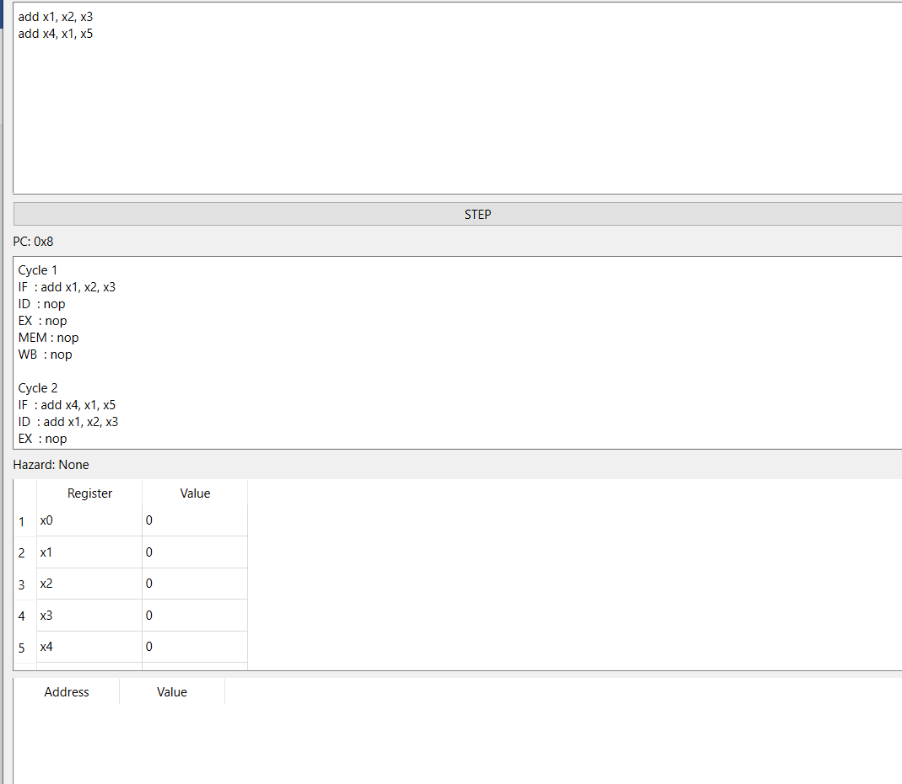
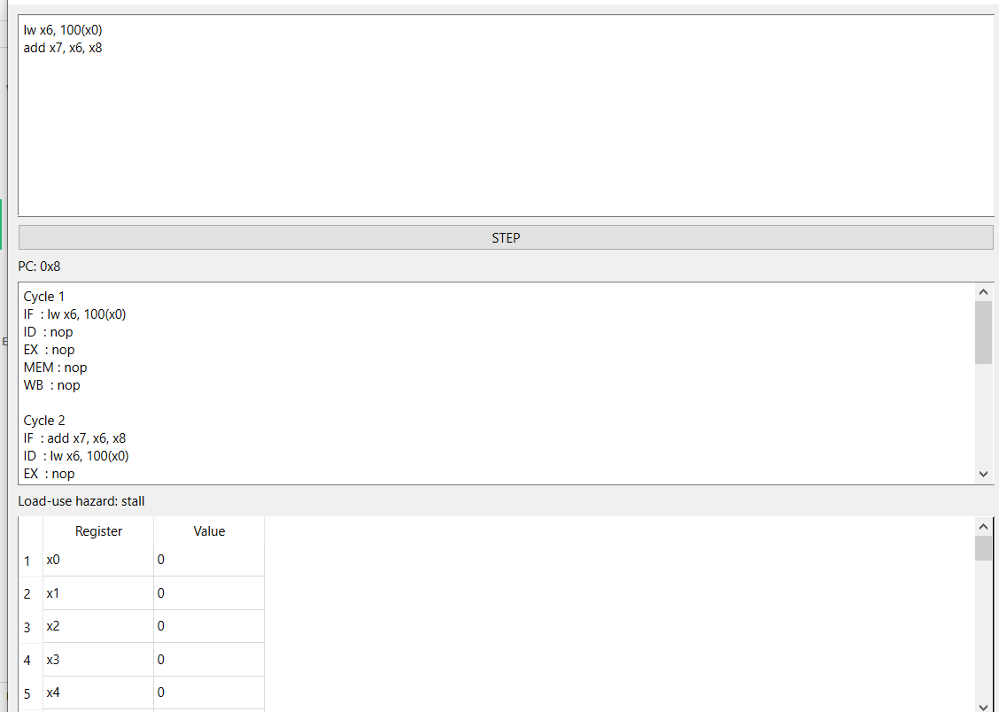
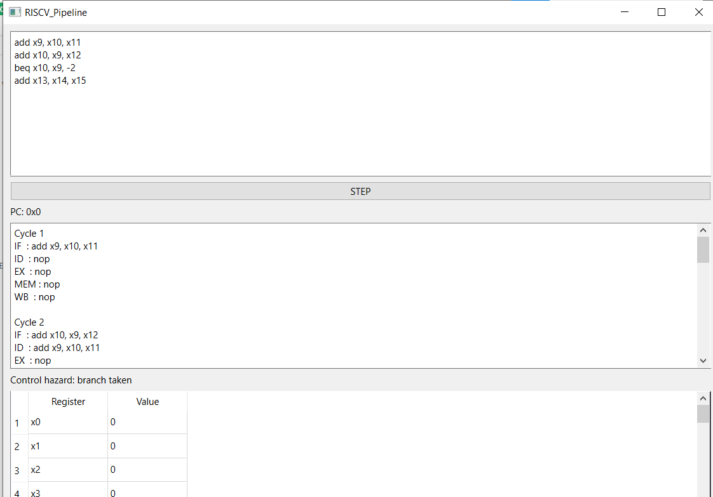

# RISC-V-PIPELINE-VISUALIZER-USING-C++
 under the MIT License. See the LICENSE file for details.

An interactive desktop tool built with **C++17** and **Qt 6** that simulates a classic 5-stage RISC-V pipeline.  
It lets you step through instructions cycle by cycle and watch how they move through the pipeline stages, how registers and memory change, and how hazards are detected and resolved.

## Overview

Modern processors complete parts of several instructions at the same time. This simulator shows what happens during each **pipeline stage** per clock cycle:

- **IF** – Instruction Fetch  
- **ID** – Instruction Decode  
- **EX** – Execute  
- **MEM** – Memory Access  
- **WB** – Write Back  

Your RISC-V code runs one cycle at a time, allowing you to see every transition.

## Features

- Step-by-step simulation with an interactive GUI  
- Real-time display of all 5 pipeline stages  
- Live register and memory views  
- Automatic load-use hazard detection  
- Clear messages and visible stalls/bubbles  
- Cycle and program counters  
- Simple instruction set  

## Supported Instructions

This lightweight simulator currently handles:

- **`lw xd, imm(xs1)`** – Load word from memory into `xd`  
- **`sw xs2, imm(xs1)`** – Store word from `xs2` into memory  
- **`add xd, xs1, xs2`** – Add two register values and save result in `xd`  

These are enough to demonstrate the core pipeline behaviors and data hazards.

## Getting Started on Windows

### Prerequisites

Make sure you have the following installed:

- **CMake 3.16+**  
- **Qt 6.x** (Qt Base, Widgets, and GUI modules)  
- **Visual Studio 2019 or newer** with C++ build tools  
- **Git** (optional, for cloning the repository)

You can verify Qt with:
```
qmake --version
```

### Build Instructions (Visual Studio)

1. Open **Developer Command Prompt for VS** or use **Qt 6 Command Prompt**.  
2. Clone and build the repository:

```batch
git clone https://github.com/your-username/your-repo.git
cd your-repo
mkdir build
cd build
cmake .. -G "Visual Studio 17 2022" -A x64
cmake --build . --config Release
```

After building, **RISCVPipeline.exe** will appear in:
```
build\Release\
```

### Run the Simulator

From the command prompt:
```batch
cd build\Release
RISCVPipeline.exe
``## Hazard Demonstrations

### Data Hazard (RAW)



### Load-Use Hazard



### Forwarding Example




The application window includes:
- A text editor for entering RISC-V assembly  
- A **STEP** button to advance the pipeline  
- Tables showing stage activity, register values, and memory contents  

## Example Program

Enter code like this in the editor:

```asm
lw x1, 0(x0)
lw x2, 4(x0)
add x3, x1, x2
sw x3, 8(x0)
```

Press **STEP** repeatedly to observe the simulation.

You will see:
- Instructions moving through each pipeline stage  
- Register `x3` receiving the computed result  
- Memory updates at address `8(x0)`  
- Cycle and program counters changing  

When all stages show `nop`, the program has completed.

## Understanding Pipeline Hazards

Processors often face timing conflicts, called **hazards**. The simulator highlights them visually, inserting *stalls* or *flushes* as required.

### 1. Data Hazard (Read-After-Write)

Occurs when an instruction attempts to read a register whose value has not yet been written back.

```asm
lw x1, 0(x0)
add x2, x1, x1
```

Here, `add` depends on `lw`.  
The simulator pauses `add` for a cycle — showing a **bubble** — until `x1` is ready.

Simplified view:

| Cycle | IF | ID | EX | MEM | WB |
|:------|:--:|:--:|:--:|:---:|:--:|
| 1     | lw | -  | -  | -   | -  |
| 2     | add| lw | -  | -   | -  |
| 3     | stall | add | lw | - | - |
| 4     | -  | stall | add | lw | - |

### 2. Structural Hazard

When two stages need the same hardware (like memory) in the same cycle.

Example:
```asm
lw x1, 0(x2)
sw x3, 4(x2)
```
If your model has a single memory port, one instruction must wait.  
The simulator visually freezes one stage with a "Memory Busy" note.

### 3. Control Hazard (Branches & Jumps)

Occurs when the CPU cannot determine the next instruction until a branch condition is known.

```asm
beq x1, x2, LABEL
add x3, x4, x5
LABEL: sub x6, x6, x7
```

Until `beq` finishes the **Execute** stage, the next instruction path is unknown.  
If the branch is taken, the visualizer *flushes* (clears) the incorrect instruction.

| Cycle | IF | ID | EX | MEM | WB |
|:------|:--:|:--:|:--:|:---:|:--:|
| 1     | beq| -  | -  | -   | -  |
| 2     | add| beq| -  | -   | -  |
| 3     | sub| add| beq| -   | -  |
| 4     | flush | sub | add | beq | - |
| 5     | LABEL | - | - | - | - |

## Internal Design

The simulator models:
- 32 general-purpose registers (x0 = 0)
- A simplified memory array
- Pipeline state registers (IF → ID → EX → MEM → WB)
- Hazard detection logic and stage control

Each clock cycle:
1. The **WB stage** updates registers.  
2. **MEM stage** performs loads/stores.  
3. The hazard unit checks for dependencies.  
4. Instructions advance to the next stage.  
5. A new instruction is fetched if space is available.  

## Folder Structure

```
.
├── CMakeLists.txt
├── main.cpp
├── mainwindow.h/.cpp
├── pipeline.h/.cpp
└── README.md
```

`mainwindow.cpp` → User interface  
`pipeline.cpp` → Simulation logic

## Future Plans

- More RISC-V instructions (sub, and, or, branches, jumps)  
- Forwarding and bypassing logic  
- "Run Continuously" mode  
- Editable initial memory and register states  
- Export trace logs  
- Unit tests  

## Contributing

1. Fork this repository  
2. Create a feature branch  
3. Test your changes  
4. Open a pull request  

## License

This project is licensed under the **MIT License**.  
See the `LICENSE` file for details.
